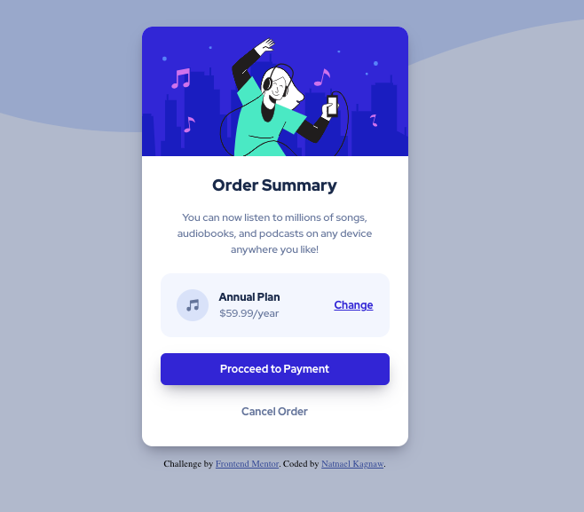

# Frontend Mentor - Order summary card solution

This is a solution to the [Order summary card challenge on Frontend Mentor](https://www.frontendmentor.io/challenges/order-summary-component-QlPmajDUj).

## Table of contents

- [Overview](#overview)
  - [The challenge](#the-challenge)
  - [Screenshot](#screenshot)
  - [Links](#links)
- [My process](#my-process)
  - [Built with](#built-with)
  - [What I learned](#what-i-learned)
  - [Continued development](#continued-development)
  - [Useful resources](#useful-resources)
- [Author](#author)
- [Acknowledgments](#acknowledgments)

## Overview

### The challenge

Users should be able to:

- See hover states for interactive elements

### Screenshot

### Links

- Solution URL: [Github Link](https://github.com/NatnaelSisay/order-summary-component-main)
- Live Site URL: [Netlify Link](https://elegant-meerkat-a8e490.netlify.app/)

## My process

### Built with

- Semantic HTML5 markup
- CSS custom properties
- Flexbox
- CSS Grid
- Mobile-first workflow

### What I learned

Thinking before implimenting CSS saves time, but too much thinking is not good either.

### Continued development

Detecting which color to use was a bit tricky for me. I need to explore tools
that could help and assist me with it for the future.
And i also would love the explore a tool that tells me which css classes i haven't used and which are not implimented

### Useful resources

- [CSS Scan](https://getcssscan.com/css-box-shadow-examples) - This helped me for setting up box shadow with just a click.
- [Josh Comeau](https://www.joshwcomeau.com/css/custom-css-reset/) - The perfect place for CSS Rest.

## Author

- LinkedIn - [Natnael Kagnaw](https://www.linkedin.com/in/natnael-kagnaw/)
- Frontend Mentor - [@NatnaelSisay](https://www.frontendmentor.io/profile/NatnaelSisay)

**Note: Delete this note and add/remove/edit lines above based on what links you'd like to share.**

## Acknowledgments

I would like to thank Front-end mentor and the discord community.
